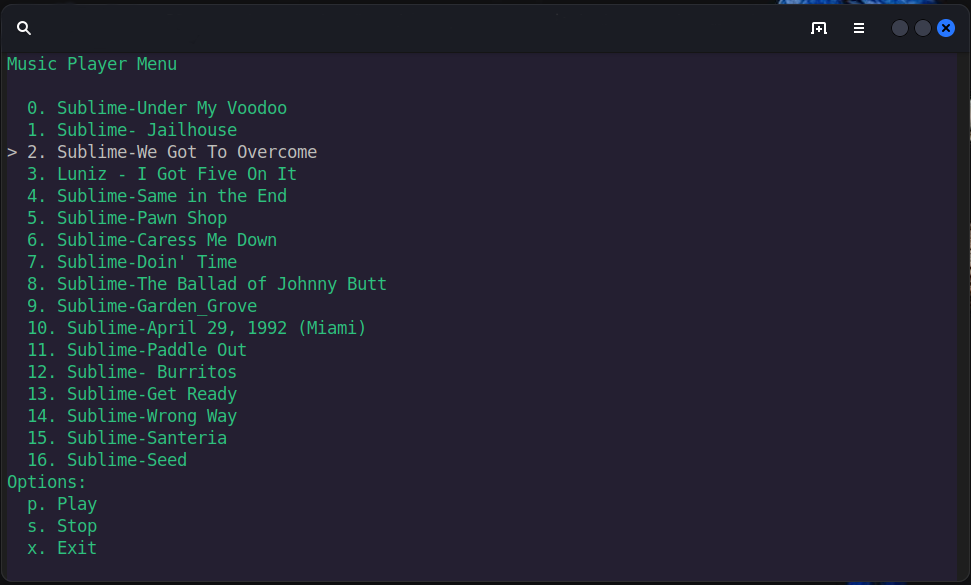

# TermTunes

[](https://www.gnu.org/licenses/gpl-3.0)



TermTunes is a minimalist console-based music player for Linux and macOS, allowing you to play and manage your music collection directly from the terminal.

## Features

- Lightweight and easy-to-use.
- Play MP3, OGG, and WAV audio files.
- Navigate and select songs using the arrow keys or keyboard shortcuts.
- Play, pause, and stop playback.
- Clean and intuitive terminal interface.

## Installation

1. Clone the repository:

   ```shell
   git clone https://github.com/yourusername/TermTunes.git
   cd TermTunes
   ```
2. Install the required dependencies (e.g., mpg123 for audio playback):
   ```sh
   sudo apt-get install mpg123
   ```
3 Run TermTunes 
```sh
python termtunes.py
```
## Usage
Use the arrow keys or keyboard shortcuts to navigate through your music collection.
- Press 'p' to play the selected song.
- Press 's' to stop playback.
- Press 'x' to exit TermTunes.
## License

This project is licensed under the GNU General Public License v3.0.

You can view the full text of the license [here](https://www.gnu.org/licenses/gpl-3.0).

Please note that by contributing to this project, you agree to abide by the terms of this license.

## Acknowledgments
- termTunes was inspired by the love for command-line interfaces and music.
- Special thanks to the open-source community for providing valuable resources and tools.
## Contributing

We welcome contributions from the community. If you'd like to contribute to TermTunes, please follow these guidelines:

1. Fork the repository.
2. Create a new branch for your feature or bug fix: `git checkout -b feature-name`.
3. Make your changes and commit them: `git commit -m 'Description of your changes'`.
4. Push your changes to your fork: `git push origin feature-name`.
5. Create a pull request (PR) on the [GitHub repository](https://github.com/yourusername/TermTunes).

Please make sure to:

- Provide a clear and descriptive title for your PR.
- Describe the purpose of your changes and the problem they solve.
- Follow the existing coding style and conventions.
- Include relevant tests for your changes if applicable.
- Ensure that your code is well-documented.

I will review your contribution, and if it aligns with the project's goals and standards, we'll merge it. Thank you for helping improve TermTunes!
## Contact

For bug reports, feature requests, or general inquiries, please create an issue on the [GitHub repository](https://github.com/yourusername/TermTunes/issues).


